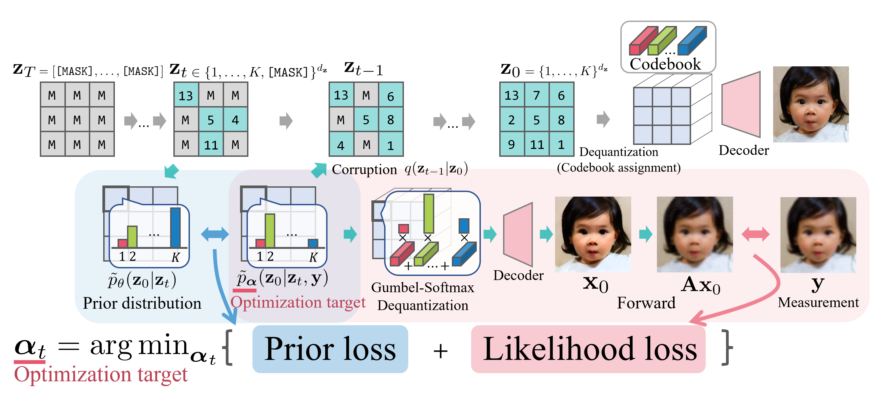

# G2D2: Gradient-Guided Discrete Diffusion for Inverse Problem Solving



- arXiv: https://arxiv.org/abs/2410.14710

- TMLR (OpenReview): https://openreview.net/forum?id=fj23qnVifX

Abstract

Recent literature has effectively leveraged diffusion models trained on continuous variables as priors for solving inverse problems. Notably, discrete diffusion models with discrete latent codes have shown strong performance, particularly in modalities suited for discrete compressed representations, such as image and motion generation. However, their discrete and non-differentiable nature has limited their application to inverse problems formulated in continuous spaces. This paper presents a novel method for addressing linear inverse problems by leveraging generative models based on discrete diffusion as priors. We overcome these limitations by approximating the true posterior distribution with a variational distribution constructed from categorical distributions and continuous relaxation techniques. Furthermore, we employ a star-shaped noise process to mitigate the drawbacks of traditional discrete diffusion models with absorbing states, demonstrating that our method performs comparably to continuous diffusion techniques with less GPU memory consumption.

Authors

**Naoki Murata**<sup>1</sup>, Chieh-Hsin Lai<sup>1</sup>, Yuhta Takida<sup>1</sup>, Toshimitsu Uesaka<sup>1</sup>, Bac Nguyen<sup>1</sup>, Stefano Ermon<sup>2</sup>, Yuki Mitsufuji<sup>1,3</sup>

<sup>1</sup> Sony AI, <sup>2</sup> Stanford University, <sup>3</sup> Sony Group Corporation

Contact: <code>naoki.murata@sony.com</code>

This repository provides code to reproduce the paper experiments (Gaussian deblurring and super-resolution) for the datasets used in the paper. It includes the exact experiment presets used in the paper and minimal wrapper code to run inference and reproduce the reported results.

Supported experiments in this repository

- Gaussian Deblur on ImageNet (val-1k)
- Super Resolution on ImageNet (val-1k)
- Gaussian Deblur on FFHQ (val-1k)
- Super Resolution on FFHQ (val-1k)

See below for usage, dataset layout, and environment setup.

## Repository structure (relevant parts)

- `main.py` — entry point. Selects experiment preset, reads dataset CSV and runs inference.
- `configs/` — example task configs. Use `experiment_preset` in a config YAML to choose a preset.
- `pipelines/` — implementation of the inference pipeline used to run the experiments.
- `util/experiments.py` — experiment presets and helper mappings used by `main.py`.
- `dataset/` — expected location of datasets and CSVs (see below).
- `docker/` — container setup.

## Environment setup

Use the provided Dockerfile to prepare a reproducible environment (recommended).

Build the image from the repository root:

```
docker build -f docker/Dockerfile -t g2d2:latest .
```

Run the container with GPU access and mount the repository:

```
docker run --gpus all -v "$(pwd)":/workspace -w /workspace -it g2d2:latest /bin/bash
```

(Optional) Manually clone BKSE if you need blur-kernel-space-exploring tools or models:

```
# from the repository root on the host
git clone https://github.com/VinAIResearch/blur-kernel-space-exploring bkse
```

## Dataset preparation

This repository expects the user to provide dataset image directories. We provide one ready CSV for FFHQ; ImageNet CSV can be generated from an image directory using the helper script.

CSV format

- Required columns: `image_path`, `caption`
  - `image_path` can be absolute or relative to the repository root
  - `caption` is the text prompt used by the pipeline (e.g. "a photo of a <label>")

FFHQ

- A sample CSV for FFHQ is included at:

```
dataset/ffhq_val_1k/image_captions_ffhq_val_1k.csv
```

- Place FFHQ images under `dataset/ffhq_val_1k/images/` so the `image_path` entries in the CSV resolve correctly.

ImageNet

- Place your ImageNet-like images (val subset or your own set) under a directory you control, for example:

```
dataset/imagenet_val_1k_256/
  img00000000.png
  img00000001.png
  ...
```

- Use the included helper script to generate `dataset/imagenet_val_captions.csv` from a directory of images and a labels file (a python dict literal mapping class indices to labels). The script is at:

```
util/datasets/prepare_imagenet_csv.py
```

Example command (from repository root):

```
python util/datasets/prepare_imagenet_csv.py \
  --image-root dataset/imagenet_val_1k_256 \
  --labels-txt dataset/imagenet1000_clsidx_to_labels.txt \
  --output-csv dataset/imagenet_val_captions.csv
```

Script options

- `--image-ext` (default `.png`) — filter images by extension
- `--filename-prefix` (default `img`) — prefix before the numeric id in filenames
- `--index-start` (default `0`) — offset before numeric id in the stem
- `--index-width` (default `8`) — zero-padded width of numeric id

Notes

- We do not include large dataset archives in this repository. Provide your own images and run the script to generate the CSV.
- Ensure that the `image_path` values in CSVs are correct relative paths or absolute paths on your machine.

## Selecting an experiment preset

We provide four presets reflecting the paper’s optimal settings (RAdam) that were previously hard-coded:

- `gblur_imagenet` — Gaussian Deblur on ImageNet
- `sr_imagenet` — Super Resolution on ImageNet
- `gblur_ffhq` — Gaussian Deblur on FFHQ
- `sr_ffhq` — Super Resolution on FFHQ

How to choose:
- Put `experiment_preset: <one_of_above>` into your config YAML (e.g., under `configs/`).
- Dataset is determined by priority: CLI `--dataset` > config `dataset` > preset default.

Example `configs/super_resolution_kl_all.yaml` addition:

```
output_dir: "output/"
# ... existing keys ...
experiment_preset: sr_imagenet
# dataset: ImageNet   # optional; otherwise implied by preset or CLI
```

## Running

Basic invocation (GPU 0):

```
python main.py --task_config configs/super_resolution_kl_all.yaml --gpu 0
```

- Override dataset explicitly if needed:

```
python main.py --task_config configs/super_resolution_kl_all.yaml --dataset ImageNet --gpu 0
```

Outputs will be written to:

```
output/<config_basename>_<UTC_TIMESTAMP>/<abbrev_params>/
```

- Timestamps are in UTC (e.g., `20250101T120000Z`) for clarity and sorting.
- A copy of the effective config is saved as `config.yaml` in the output directory.

### Examples by preset

- Gaussian Deblur on ImageNet (uses `configs/gaussian_deblur_kl_all.yaml`, set `experiment_preset: gblur_imagenet` in the YAML):

```bash
python main.py --task_config configs/gaussian_deblur_kl_all.yaml --dataset ImageNet --gpu 0
```

- Super Resolution on ImageNet (uses `configs/super_resolution_kl_all.yaml`, set `experiment_preset: sr_imagenet`):

```bash
python main.py --task_config configs/super_resolution_kl_all.yaml --dataset ImageNet --gpu 0
```

- Gaussian Deblur on FFHQ (uses `configs/gaussian_deblur_kl_all.yaml`, set `experiment_preset: gblur_ffhq`):

```bash
python main.py --task_config configs/gaussian_deblur_kl_all.yaml --dataset FFHQ --gpu 0
```

- Super Resolution on FFHQ (uses `configs/super_resolution_kl_all.yaml`, set `experiment_preset: sr_ffhq`):

```bash
python main.py --task_config configs/super_resolution_kl_all.yaml --dataset FFHQ --gpu 0
```

Notes
- You can omit `--dataset` if you provided `dataset:` in the YAML or if it’s implied by the preset.

## Config and CLI reference

### CLI flags

- `--task_config PATH` (required): Path to the YAML config file.
- `--gpu INT` (default `0`): CUDA device index; falls back to CPU if CUDA is unavailable.
- `--dataset {ImageNet,FFHQ}` (optional): Dataset to evaluate. Overrides the YAML and preset default.

### Key config options (YAML)

- `output_dir`: Base directory where results are written.
- `experiment_preset`: One of `gblur_imagenet`, `sr_imagenet`, `gblur_ffhq`, `sr_ffhq`. Selects paper-tuned hyperparameters.
- `dataset` (optional): `ImageNet` or `FFHQ`. Can be overridden by CLI or implied by preset.

- `diffusion.num_inference_steps` (int): Number of sampler steps.
- `diffusion.guidance_scale` (float): Classifier-free guidance scale for sampling.
- `diffusion.truncation_rate` (float): Truncation used by the VQ model sampler.

- `task.num_itr_optim_model_output_kl` (int): Iterations for KL-guided optimization.
- `task.lr_optim_model_output_kl` (float): Learning rate for KL-guided optimization.
- `task.temperature_optim_model_output_kl` (float): Temperature for optimization.
- `task.coef_kl` (float): KL coefficient.
- `task.save_intermed_figs` (bool): Save intermediate figures.

- Preset-injected task hyperparameters (set automatically when `experiment_preset` is used):
  - `task.coef_forget`, `task.init_vec_kl_coef_weight`, `task.init_vec_lr_weight`, `task.type_posterior`, and a preset `guidance_scale`.

Tip
- Effective parameters for each run are saved to the run’s `config.yaml` under the output directory.

## Reproducibility notes

- The presets are defined in `util/experiments.py` and are loaded by `main.py`.
- The dataset CSV must use the exact column names `image_path` and `caption`.
- We do not set random seeds in `main.py`. For strict determinism, set seeds for PyTorch/CUDA and ensure deterministic ops in your environment.
- GPU with CUDA is recommended due to the use of `float16` and model size.

## Citation

```
@article{murata2025g2d2,
  title   = {G2D2: Gradient-Guided Discrete Diffusion for Inverse Problem Solving},
  author  = {Murata, Naoki and Lai, Chieh-Hsin and Takida, Yuhta and Uesaka, Toshimitsu and Nguyen, Bac and Ermon, Stefano and Mitsufuji, Yuki},
  journal = {Transactions on Machine Learning Research},
  year    = {2025},
}
```

## Acknowledgements

- Pretrained model: `microsoft/vq-diffusion-ithq`.
- Blur-kernel-space-exploring: https://github.com/VinAIResearch/blur-kernel-space-exploring

## License

- This repository is licensed under the Apache License 2.0 (see [`LICENSE`](LICENSE)).
- Optional tools referenced in README (e.g., BKSE) are not included; if you use them, follow their licenses.
- See [`NOTICE`](NOTICE) for attribution notes. Model weights and datasets may carry separate licenses; review their terms (e.g., `microsoft/vq-diffusion-ithq`, CLIP, ImageNet/FFHQ).
